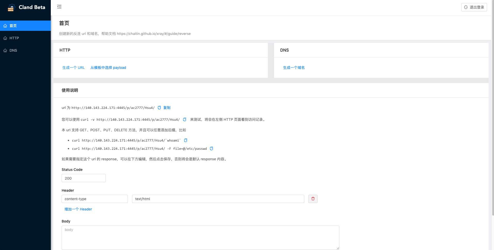

# 反连平台

反连平台常用于解决没有回显的漏洞探测的情况，最常见的应该属于 ssrf 和 存储型xss。渗透测试人员常用的 xss 平台就是反连平台。
如果你不理解上面这句话，可以先去学习一下这两个漏洞，否则这篇文章也是看不懂的。

在 xray 中，反连平台默认不启用，因为这里面有些配置没有办法自动化，必须由人工配置完成才可使用。需要反连平台才可以检测出来的漏洞包括但不限于：

+ ssrf
+ fastjson
+ s2-052
+ xxe 盲打
+ 所有依赖反连平台的 poc

反连平台相关的配置为:

```yaml
reverse:
  db_file_path: ""                      # 反连平台数据库文件位置, 这是一个 KV 数据库
  token: ""                             # 反连平台认证的 Token, 独立部署时不能为空
  http:
    enabled: true
    listen_ip: 0.0.0.0
    listen_port: ""
    ip_header: ""                       # 在哪个 http header 中取 ip，为空代表从 REMOTE_ADDR 中取
  client:
    remote_server: false                # 是否是独立的远程 server，如果是要在下面配置好远程的服务端地址
    http_base_url: ""                   # 默认将根据 ListenIP 和 ListenPort 生成，该地址是存在漏洞的目标反连回来的地址, 当反连平台前面有反代、绑定域名、端口映射时需要自行配置
    dns_server_ip: ""                   # 和 http_base_url 类似，实际用来访问 dns 服务器的地址
```

如果你对比过本地生成的配置文件会发现我们隐掉了 dns 相关的配置，这是因为这部分的配置非常繁杂易错，xray 内部也暂时没有用到依赖 dns server 的检测, 我们放在后面简单介绍一下留给感兴趣的同学自行探索吧。

接下来我们从场景触发，介绍在不同场景下应该如何配置反连平台才能扫出上述依赖反连的漏洞。

## 场景分析

!> 注意，下面的配置删除了没有修改的项目

### 场景1 - xray 和目标可以使用 ip 双向互联

假设 192.168.1.2 是 xray 所在机器的地址

```yaml
reverse:
  http:
    enabled: true
    listen_ip: 192.168.1.2
```

这里的 192.168.1.2 是 xray 所在的机器的地址, 也是扫描目标反连时所使用的地址，换句话说，当目标存在漏洞时，目标将主动访问 `http://192.168.1.2:xxx/xxx`，xray 会受到这样的“反连”回来的请求，并将漏洞结果展示出来。

### 场景2 - xray 和目标可以使用 ip 双向互联，但 listen 的地址和目标反连访问的地址不一样

这种情况经常出现在云主机中，比如腾讯云的 linux 机器网卡地址时 10.xxx，但实际公网假设是 221.xxx

```yaml
reverse:
  http:
    enabled: true
    listen_ip: 0.0.0.0
  client:
    http_base_url: "http://221.xxx:${port}" 
```

`${port}` 是一个预定义的宏，在运行时将被替换为实际监听的端口, 当然你也可以使用这种方式固定监听的端口：

```yaml
reverse:
  http:
    enabled: true
    listen_ip: 0.0.0.0
    listen_port: 8888
  client:
    http_base_url: "http://221.xxx:8888" 
```

### 场景3 - 独立部署反连平台

上面两种场景说的都是在扫描时临时启动一个反连平台，实际上单独部署一个反连平台更加常见，比如上面说的 xss 平台其实就是单独部署的一个反连平台。

xray 自带了一个 `reverse` 命令，可以启动反连平台作为一个远程服务运行，给多个客户端使用。

```
./xray reverse
```

在启动之前，需要配置好配置文件的 `db_file_path` 和 `token`，前者用于存储数据，后者用于服务端和客户端通信的秘钥。

一个示例的服务端配置是：

```yaml
# 服务端
reverse:
  db_file_path: "reverse.db"
  token: "please_change_me_to_a_new_token"
  http:
    listen_ip: 0.0.0.0
    listen_port: "80"
```

与之对应的客户端配置是：

```yaml
reverse:
  token: "please_change_me_to_a_new_token"
  client:
    remote_server: true
    http_base_url: "http://YOUR_REVERSE_SERVER_IP:80"
```

这样扫描的时候就可以直接使用远程的反连服务，而无需自行启动。

!> 这种场景要求客户端和服务端使用的版本相同，否则可能出现协议不一致导致失败的情况。

## 管理界面

反连平台贴心的内置了一个管理界面，可以访问反连平台 http 地址，url 为 `/cland/`。

功能包括

 - 生成自定义 url，并记录访问记录
 - 生成自定义域名，并记录解析记录
 - 使用平台预制 payload，记录抓取的数据




## 尝试一下！

我相信你看了上面的配置依然是云里雾里，不妨自己试一下！一个很好的测试例子是 fastjson，从 vulhub 上拉取一个镜像并启动，配置好你的反连平台看下能不能扫出吧！

!> fastjson 扫描仅高级版才支持

!> mac 下的 docker 由于网络环境特殊，其实无法双向互联，建议使用远程部署的模式或使用 `host.docker.internal` 作为 http_base_url 的 host


## DNS 相关

这里简单介绍下，有兴趣的同学可以自行探索下。也欢迎各位贡献折腾的过程。

- listen_ip 监听的 ip
- domain 在 dns 查询的时候的一级域名，默认为空，将使用随机域名。
- resolve 的配置类似常见的 dns 配置，如果反连平台收到配置的域名的解析请求，将按照配置的结果直接返回。
- is_domain_name_server 如果上述域名的 ns 服务器就是反连平台的地址，那么直接使用 `dig random.domain.com` 就可以让 dns 请求到反连平台，否则需要 `dig random.domain.com @reverse-server-ip` 指定 dns 服务器才可以。本配置项是指有没有配置 ns 服务器为反连平台的地址，用于提示扫描器内部 payload 的选择。
