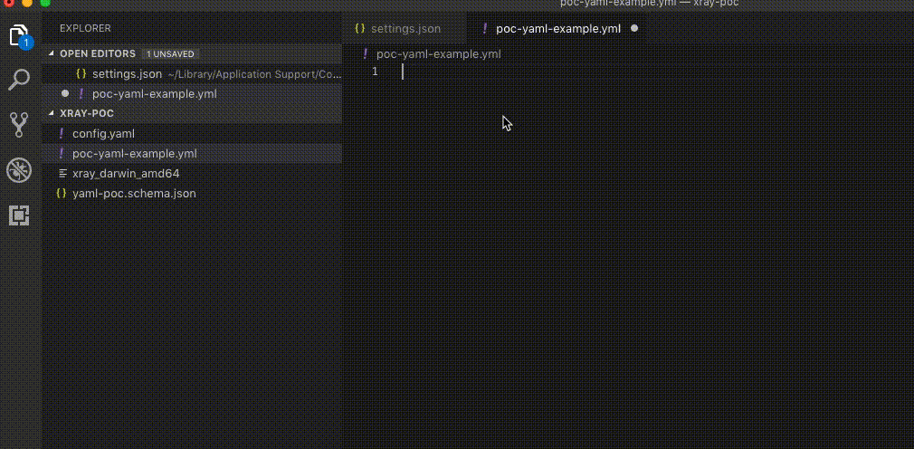

# 如何编写YAML格式POC

xray支持用户自己编写YAML格式的POC规则，YAML是JSON的超集，也就是说，你甚至可以用JSON编写POC，但这里还是建议大家使用YAML来编写，原因如下：

1. YAML的值无需使用双引号包裹，所以特殊字符无需转义
2. YAML的内容更加可读
3. YAML中可以使用注释

## 设计目标

设计目标:

1. 简洁而优雅
2. 能覆盖大部分常见扫描规则场景，包括不限于
    1. 主机指纹识别
    2. WEB 指纹识别
    3. 主机漏洞探测
    4. WEB 漏洞探测

我们希望：

1. 对规则本身提供一个很好的抽象，屏蔽掉编程语言的复杂度，只专注于规则本身。
2. 我们希望能给安全开发者更少学习成本以及更简单的编写规则，能统一目前各种规则的驳杂。

## POC 脚本格式

- [V2 版本](guide/poc/v2)
- [V1 版本](guide/poc/v1)

## 编写环境

### VSCode

使用 VSCode，进行一些配置后可以提供一些智能提示，方便编写 POC。

首先安装 https://marketplace.visualstudio.com/items?itemName=redhat.vscode-yaml 插件，然后在 settings 中确认 Extensions - YAML 中相关的开关已经打开。然后点击 `Edit in settings.json`，将 json 内容修改为

```javascript
{
    "yaml.schemas": {
        "https://raw.githubusercontent.com/chaitin/gamma/master/static/schema/schema.json": ["fingerprint-yaml-*.yml", "poc-yaml-*.yml"]
    }
}
```

这样创建 `poc-yaml-` 开头的 `yml` 为拓展名的文件的时候，就可以自动提示了。

注意，由于插件的 bug，除了第一行以外，其他的内容无法直接提示，需要使用快捷键让 VSCode 显示提示，一般是 `ctrl` + `Space`。



### jetbrains 系列 IDE

[下载文件](https://raw.githubusercontent.com/chaitin/gamma/master/static/schema/schema.json)

## 生命周期

为了帮助大家更好的理解 poc 中各部分的作用，此处先介绍一下一个 yaml poc 的执行过程。

在一个 yaml poc 从文件加载到 go 的某个结构后，会首先对表达式进行预编译和静态类型检查，这一过程主要作用于 yaml 中的 set 和 expression 部分，这两部分是 yaml poc 的关键，主要用到了 CEL 表达式。

在检查完成后，内存中的 poc 就处于等待调度的状态了。每当有**新的请求**来临时，会执行类似如下的伪代码:

```golang
for rule in rules:
    newReq = mutate_request_by_rule(req, rule)
    response = send(newReq)
    if not check_response(response, rule):
        break
```

简单来讲就是将请求根据 rule 中的规则对请求变形，然后获取变形后的响应，再检查响应是否匹配 `expression` 部分的表达式。如果匹配，就进行下一个 rule，如果不匹配则退出执行。
如果成功执行完了最后一个 rule，那么代表目标有漏洞，将 detail 中的信息附加到漏洞输出后就完成了单个 poc 的整个流程。

目前版本的实现对**新的请求**定义为: **新的目录**, 比如下面几个 url 依次进入检查队列时，执行情况如下：

```
http://exmaple.com/     会执行, 上下文为 / 
http://example.com/a    不会再次执行，因为上下文同样为 /
http://example.com/a/b  会执行，上下文为 /a/
http://example.com/a/c/ 不会执行, 超过深度限制 (depth)
```

其中 `depth` 是 phantasm 插件的一个配置项，用于指定检测深度，可以参考： [插件配置](/configration/plugins?id=dirscan)

## 转义说明

在编写expression表达式的时候，尤其要注意一个问题：yaml字符串的转义，与CEL表达式字符串里的转义。

yaml中，如果要编写一个字符串类型的值，可以使用引号进行包裹，如：

```yaml
name: "value"
```

但如果value中有反斜线，会在解析yaml的时候进行转义。那么如果expression表达式代码中也存在双引号或转义符，此时转义符就已经没有了，我们需要双重转义，这个时候编写的代码就非常不可读也不可维护。

所以，建议使用yaml中支持的[块样式（block style）](https://yaml.org/spec/1.2/spec.html#style/block/)来表示，如：

```
expression: |
  response.status == 200 && response.body.bcontains(b'\x01\x02\x03')
```

此时在YAML层面无需转义。

## 如何调试 poc

如果 poc 无法扫出期望的结果，可以按照以下思路调试

- 确定 poc 语法正确，payload 正确。
- 在配置文件 `http` 段中加入 `proxy: "http://proxy:port"`，比如设置 burpsuite 为代理，这样 poc 发送的请求可以在 burp 中看到，看是否是期望的样子。
